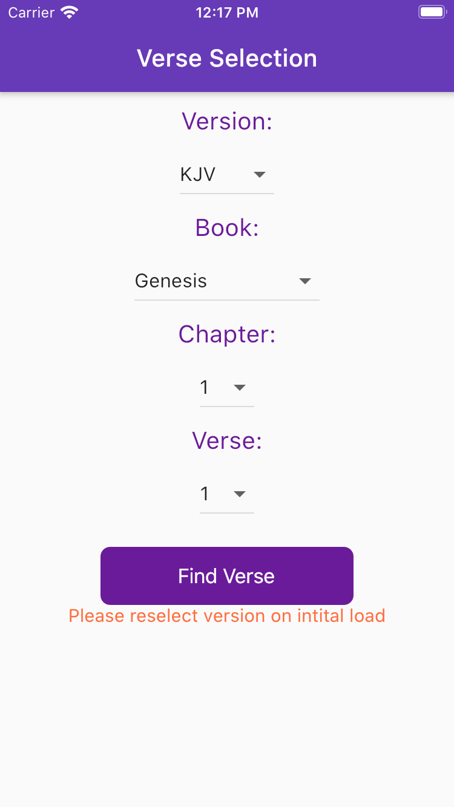
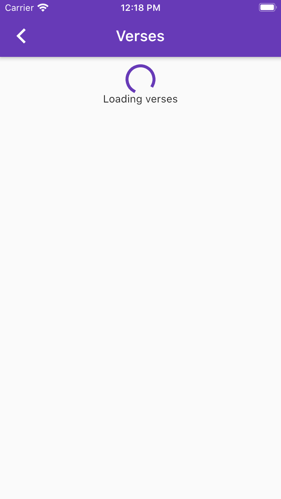
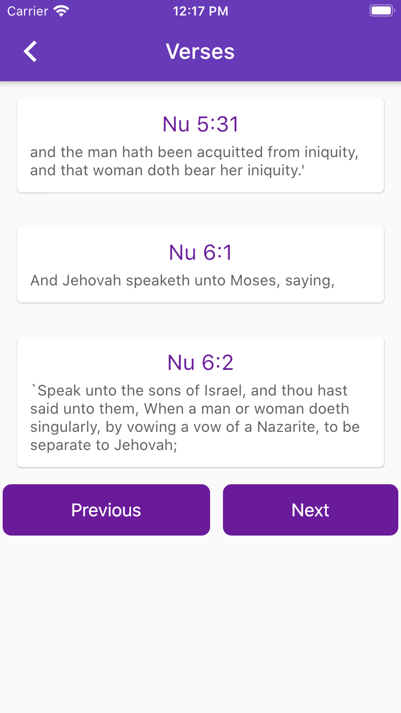

# Bible App
A cross-platform (Android and iOS) mobile app that displays Bible verses. 
The user can navigate between verses using an on-screen dropdown or on-screen buttons. In addition, the user can select between 5+ Bible versions.

# Installation
This project was developed using Flutter. Visit flutter's [installtion guide](https://flutter.dev/docs/get-started/install) for installation instructions.

# Screenshots

  
  
  

